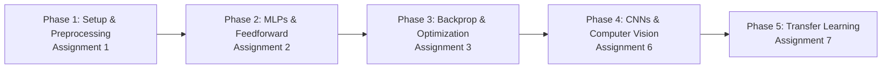

# Deep Learning

> **B.Tech Deep Learning Coursework Portfolio — Assignments, Experiments & Practical Implementations**

[](https://www.python.org/)
[](https://www.tensorflow.org/)
[](https://keras.io/)
[](https://jupyter.org/)
[](LICENSE)

Welcome to my **Deep Learning Course Portfolio**. This repository documents my academic journey, practical implementations, and experimental evaluations conducted during my **B.Tech** coursework in Deep Learning. 

It contains end-to-end Jupyter Notebooks (`.ipynb`), structured theoretical and technical assignment reports (`.pdf`), custom model architectures, dataset preprocessing workflows, and empirical evaluations across various Deep Learning paradigms.

---

## 📌 Table of Contents

- [About This Repository](#-about-this-repository)
- [Repository Highlights](#-repository-highlights)
- [Topics Covered](#-topics-covered)
- [Repository Structure](#-repository-structure)
- [Assignments & Coursework](#-assignments--coursework)
- [Minor & Major Projects](#-minor--major-projects)
- [Tech Stack & Tools](#-tech-stack--tools)
- [Learning Journey](#-learning-journey)
- [How to Use This Repository](#-how-to-use-this-repository)
- [Running the Notebooks](#-running-the-notebooks)
- [Key Results & Visualizations](#-key-results--visualizations)
- [Future Work & Roadmap](#-future-work--roadmap)
- [Author](#-author)

---

## 📖 About This Repository

This repository serves as a comprehensive portfolio reflecting both theoretical understanding and hands-on programming skills in **Deep Learning**. 

### Purpose & Objectives:
- **Academic Rigor**: Consolidate B.Tech Deep Learning coursework, lab assignments, and technical reports into a clean, reproducible repository.
- **Hands-On Experimentation**: Implement fundamental and advanced Deep Learning concepts from scratch and using high-level frameworks like TensorFlow and Keras.
- **Empirical Analysis**: Evaluate model behavior through loss curves, accuracy metrics, confusion matrices, and hyperparameter sensitivity studies (e.g., impact of learning rates and epoch counts).
- **Portfolio Showcase**: Present well-documented code, clear Markdown explanations, and verifiable outputs for academic reviewers, recruiters, and peers.

---

## 🌟 Repository Highlights

- 📘 **Structured Assignments**: End-to-end implementations covering data preprocessing, MLPs, backprop math, CNNs, and Transfer Learning.
- 🧪 **Hyperparameter Sensitivity Studies**: Empirical analysis of learning rate variations ($\eta = 0.001 \rightarrow 0.5$) and training convergence.
- 👁️ **Computer Vision Models**: Custom Convolutional Neural Networks for multi-class plant disease classification across 10 leaf condition categories.
- 🔄 **Transfer Learning Benchmarking**: Comparative analysis of state-of-the-art pre-trained architectures (ResNet50 vs. MobileNetV2).
- 📓 **Reproducible Notebooks**: Fully documented Jupyter Notebooks formatted with clean Markdown sections, inline code comments, and visualizations.
- 📄 **Technical Reports**: Detailed PDF documentation accompanying assignments, outlining problem statements, math derivations, and output analyses.

---

## 🧠 Topics Covered

The codebase directly implements and demonstrates the following core Deep Learning concepts:

| Category | Concepts & Techniques Implemented |
| :--- | :--- |
| **Frameworks & Preprocessing** | TensorFlow 2.x, Keras API, Data Normalization (`MinMaxScaler`, `StandardScaler`), Feature Scaling, Train/Test Splitting |
| **Artificial Neural Networks** | Multilayer Perceptrons (MLP), Dense Layers, Feedforward Architecture, Activation Functions (ReLU, Softmax, Sigmoid) |
| **Optimization & Mechanics** | Forward Propagation, Backpropagation Algorithm, Gradient Descent, Loss Functions (Categorical & Binary Cross-Entropy), Learning Rate Sensitivity, Epoch Dynamics |
| **Computer Vision (CNNs)** | 2D Convolutions (`Conv2D`), Max Pooling (`MaxPooling2D`), Dropout Regularization, Flattening, Image Augmentation (`ImageDataGenerator`), Single-Image Inference |
| **Transfer Learning** | Feature Extraction, Fine-tuning, Layer Freezing/Unfreezing, ImageNet Pre-trained Backbones, ResNet50, MobileNetV2, Parameter Benchmarking |
| **Model Evaluation** | Confusion Matrix Heatmaps, Classification Reports (Precision, Recall, F1-Score), Accuracy/Loss Curves, Single-Sample Prediction Pipeline |

---

## 📂 Repository Structure

The repository is organized cleanly into modular directories for each assignment and dataset:

```text
Deep-Learning/
│
├── Assignment_1/
│   ├── Assignment 1.ipynb          # TensorFlow/Keras environment setup & data preprocessing
│   └── Assignment_1.pdf            # Technical report on framework setup & feature scaling
│
├── Assignment_2/
│   ├── Assignment_2.ipynb          # Multilayer Perceptron (MLP) for multi-class Iris classification
│   └── Assignment 2.pdf            # Technical report on MLP architecture & evaluation metrics
│
├── Assignment_3/
│   ├── Assignment_3.ipynb          # Forward & Backpropagation with learning rate sensitivity analysis
│   ├── Assignment 3.pdf            # Technical report on backpropagation math & epoch convergence
│   └── heart.csv                   # Tabular dataset used for binary classification experiments
│
├── Assignment_6/
│   ├── Assignment_6.ipynb          # CNN for Tomato Leaf Disease Classification (10 classes)
│   ├── Assignment 6.pdf            # Technical report on CNN architecture & disease detection
│   └── tomato/                     # Plant disease image dataset (10 condition subdirectories)
│       ├── Bacterial_spot/
│       ├── Early_blight/
│       ├── Healthy/
│       ├── Late_blight/
│       ├── Leaf_Mold/
│       ├── Mosaic_virus/
│       ├── Septoria_leaf_spot/
│       ├── Spider_mites Two-spotted_spider_mite/
│       ├── Target_Spot/
│       └── Yellow_Leaf_Curl_Virus/
│
├── Assignment_7/
│   └── Assignment_7.ipynb          # Transfer Learning comparison (ResNet50 vs. MobileNetV2)
│
└── README.md                       # Comprehensive course portfolio documentation
```

---

## 📑 Assignments & Coursework

The table below provides direct links to the code notebooks and technical PDF reports for each assignment:

| # | Assignment Title | Key Concepts & Methods | Notebook | Technical Report |
| :-: | :--- | :--- | :-: | :-: |
| **01** | **TensorFlow/Keras Environment Setup & Data Preprocessing** | Framework verification, feature scaling (`StandardScaler`, `MinMaxScaler`), train-test split, baseline Keras Sequential model | [📓 Notebook](./Assignment_1/Assignment%201.ipynb) | [📄 Report](./Assignment_1/Assignment_1.pdf) |
| **02** | **Multilayer Perceptron (MLP) for Multi-Class Classification** | Dense neural network architecture, ReLU/Softmax activations, Iris dataset classification, loss/accuracy curves, confusion matrix | [📓 Notebook](./Assignment_2/Assignment_2.ipynb) | [📄 Report](./Assignment_2/Assignment%202.pdf) |
| **03** | **Forward & Backpropagation Sensitivity Analysis** | Deep Neural Networks, backpropagation gradient math, loss convergence across learning rates ($\eta = 0.001 \rightarrow 0.5$), epoch analysis | [📓 Notebook](./Assignment_3/Assignment_3.ipynb) | [📄 Report](./Assignment_3/Assignment%203.pdf) |
| **06** | **CNN for Tomato Leaf Disease Image Classification** | Custom Sequential CNN (`Conv2D`, `MaxPooling2D`, `Dropout`), 10-class Tomato leaf disease detection, inference prediction pipeline | [📓 Notebook](./Assignment_6/Assignment_6.ipynb) | [📄 Report](./Assignment_6/Assignment%206.pdf) |
| **07** | **Transfer Learning Benchmarking (ResNet50 vs. MobileNetV2)** | Pre-trained ImageNet backbones, feature extraction vs fine-tuning, layer freezing, parameter efficiency & accuracy evaluation | [📓 Notebook](./Assignment_7/Assignment_7.ipynb) | — |

---

## 🚀 Minor & Major Projects

In addition to foundational coursework assignments, this repository is expanding to include practical project modules:

### 🛠️ Minor Projects (In-Course Case Studies)
- **Tomato Leaf Disease Classifier (Assignment 6)**: An end-to-end computer vision pipeline using a custom 4-block Convolutional Neural Network to classify plant leaf diseases into 10 distinct categories, featuring dynamic image loading and automated single-image diagnostic predictions.
- **Pre-Trained Backbone Benchmarking (Assignment 7)**: A comparative architectural evaluation measuring the accuracy, loss convergence, and inference parameters of **ResNet50** vs. **MobileNetV2** for transfer learning tasks.

### 🏗️ Major Projects (Upcoming / Under Development)
- **Deep Learning Capstone Project**: An upcoming end-to-end deep learning system incorporating advanced architectures (e.g., Object Detection, GANs, or Transformers) with web model deployment (Streamlit / FastAPI).

---

## 🛠️ Tech Stack & Tools

### Programming Language
- **Python 3.8+**

### Deep Learning & Machine Learning Frameworks
- **TensorFlow 2.x** & **Keras API**
- **Scikit-Learn** (Preprocessing, Dataset utilities, Metrics)

### Data Processing & Visualization
- **NumPy** & **Pandas** (Matrix computation & tabular data handling)
- **Matplotlib** & **Seaborn** (Loss curves, confusion matrices, image grids)

### Interactive Environments & Tools
- **Jupyter Notebook** / **JupyterLab**
- **Google Colab** (GPU acceleration for CNN training)
- **VS Code**

---

## 📈 Learning Journey

This repository demonstrates a structured academic progression through the core pillars of Deep Learning:



1. **Foundations (Assignment 1)**: Mastering framework installation, tensor structures, data normalization (`StandardScaler`, `MinMaxScaler`), and building initial Sequential models.
2. **Multi-Class Neural Networks (Assignment 2)**: Constructing multi-layer dense networks (MLPs) with non-linear activation functions (ReLU, Softmax) and evaluating multi-class performance metrics.
3. **Mathematical Deep Dive (Assignment 3)**: Dissecting the mechanics of forward propagation and backpropagation, analyzing how gradient descent responds to varying learning rates ($\eta$) and epoch counts.
4. **Spatial Feature Extraction (Assignment 6)**: Transitioning from flat vector inputs to 2D image matrices using Convolutional Neural Networks (`Conv2D`, `MaxPooling2D`, `Dropout`) for real-world image classification.
5. **Pre-Trained Architectures (Assignment 7)**: Harnessing transfer learning and domain adaptation with ImageNet pre-trained backbones (ResNet50, MobileNetV2), analyzing feature extraction vs. fine-tuning performance.

---

## 💻 How to Use This Repository

### 1. Clone the Repository
```bash
git clone https://github.com/SwarajShedge27/Deep-Learning.git
cd Deep-Learning
```

### 2. Set Up a Virtual Environment (Recommended)
```bash
# Create virtual environment
python -m venv dl_env

# Activate environment (Windows)
dl_env\Scripts\activate

# Activate environment (macOS/Linux)
source dl_env/bin/activate
```

### 3. Install Dependencies
Install the required packages using `pip`:
```bash
pip install tensorflow keras numpy pandas matplotlib seaborn scikit-learn jupyter
```

### 4. Launch Jupyter Notebook / JupyterLab
```bash
jupyter notebook
```
Navigate to any assignment folder (e.g., `Assignment_6/`) and open the corresponding `.ipynb` notebook.

---

## ⚙️ Running the Notebooks

- **Standard CPU Run**: Notebooks for Assignments 1, 2, and 3 run quickly on standard CPU configurations.
- **GPU Acceleration (Recommended for CNNs & Transfer Learning)**: For `Assignment_6` (Tomato Leaf Disease CNN) and `Assignment_7` (Transfer Learning), it is recommended to run the notebooks using **Google Colab** or a local CUDA-enabled GPU environment to accelerate model training.
- **Dataset Paths**: The notebooks contain relative dataset paths (e.g., `./Assignment_3/heart.csv` or `./Assignment_6/tomato`). Ensure your working directory matches the notebook root when executing cells.

---

## 📊 Key Results & Visualizations

| Assignment | Target Task / Dataset | Key Model Metric | Visual Outputs Provided |
| :--- | :--- | :--- | :--- |
| **Assignment 1** | Feature Preprocessing & Baseline Model | Data distribution verified, scaled features | Normalization comparisons & feature plots |
| **Assignment 2** | Multi-Class Iris Classification | High test accuracy across 3 Iris species | Epoch-wise accuracy/loss curves & confusion matrix heatmap |
| **Assignment 3** | Binary Classification & Backprop Analysis | Evaluated gradient convergence | Comparative loss decay plots across $\eta \in \{0.001, 0.01, 0.1, 0.5\}$ |
| **Assignment 6** | Tomato Leaf Disease Detection (10 classes) | Multi-class image classification | Training/validation loss curves & single-image diagnostic prediction output |
| **Assignment 7** | ResNet50 vs. MobileNetV2 Benchmarking | Parameter count vs. accuracy comparison | Training history comparisons between pre-trained backbones |

---

## 🔮 Future Work & Roadmap

- [ ] **Additional Coursework Assignments**: Integrating upcoming lab assignments covering Recurrent Neural Networks (RNNs, LSTMs).
- [ ] **Generative AI & Autoencoders**: Implementing Autoencoder architectures for image denoising and dimensionality reduction.
- [ ] **Advanced Computer Vision**: Exploring Object Detection architectures (YOLO / Faster R-CNN) and Segmentation networks.
- [ ] **Hyperparameter Optimization**: Incorporating automated hyperparameter tuning using **KerasTuner** or **Optuna**.
- [ ] **Interactive Web Deployment**: Building a Streamlit / Gradio web application for the Tomato Leaf Disease diagnostic model.

---

## 👤 Author

**Swaraj Shedge**  
*B.Tech Student | Deep Learning & Artificial Intelligence Enthusiast*  

- **GitHub**: [@SwarajShedge27](https://github.com/SwarajShedge27)
- **Repository**: [Deep-Learning](https://github.com/SwarajShedge27/Deep-Learning)

---

<p align="center">
  <i>⭐ If you find this course portfolio helpful or informative, feel free to give the repository a star! ⭐</i>
</p>
